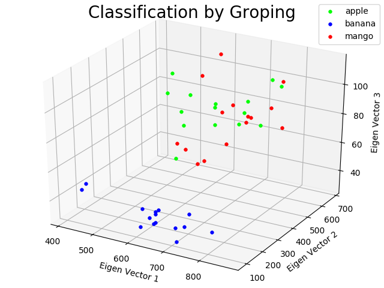

fruit_trace_datasets
====================

- Dataset composition
  - *.l   -> 3D point cloud of fruits is saved.
  - *.txt -> principal component value of the point cloud is saved.

- Load *.l file
  - `roseus` and `(load "*.l")`
  - variable `in-hand-cloud` (instance of pointcloud in euslisp) can be loaded.
  - you can extract point information by `(send in-hand-cloud :points)` or `(send in-hand-cloud :point-list)`

- Load *.txt file
  - you can use `load_data` function in `classify_fruit.py`.

- Apply PCA to *.l file
  - you can use `pca` function below.
  - e.g. you can use `(car (pca (send in-hand-cloud :point-list)))` to extract principal components.

  --
  ```
  (defun pca (point-list)
    (let ((x nil) (y nil) (z nil) (eigen-decompose-ret nil) (eigen-vector nil))
      (dolist (point point-list)
        (setq x (append x (list (aref point 0))))
        (setq y (append y (list (aref point 1))))
        (setq z (append z (list (aref point 2)))))
      (setq eigen-decompose-ret (eigen-decompose (covariance-matrix (list x y z))))
      (setq eigen-vector (car eigen-decompose-ret))
      eigen-decompose-ret
      ))
  ```

- Visualization of fruit classification
  - type `./classify_fruit.py` and classification result below is visualized.
  - PCA is used for feature extraction.
    - Feature value is three principal components of 3D point cloud (`PCA`).
  - classification is based on `k-nearest neighbor`.
    - In `Leave One Out` method, the best score is achieved when `k=7`.



